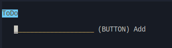
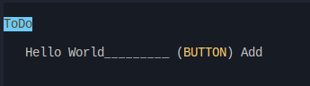

# todo-cli

## Dependencies

- lynx
- node
- yarn

## How to run 

```bash
# install dependencies
yarn i --frozen-lockfile
# build CLI server
yarn export

# open CLI
lynx out/index.html
```

## Screenshots





## ToDo (of my ToDo)

- Fix inputs not doing anything
